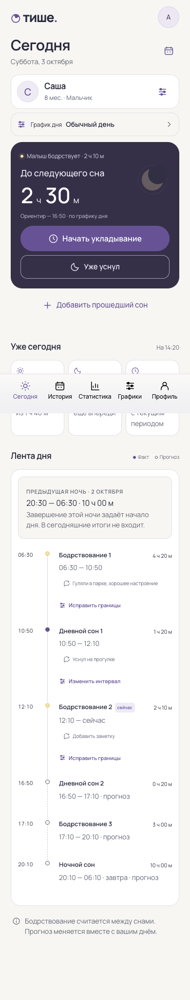
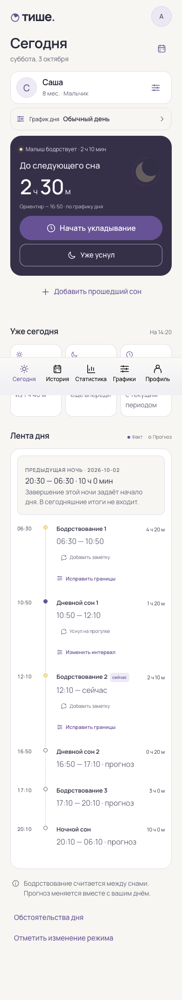
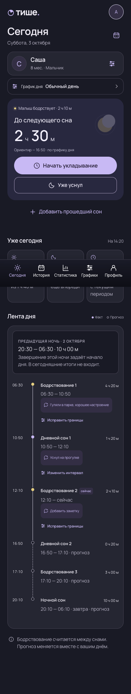
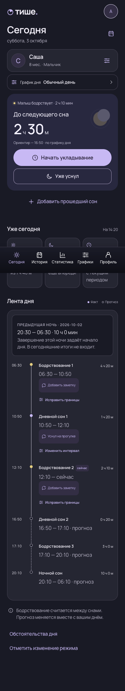
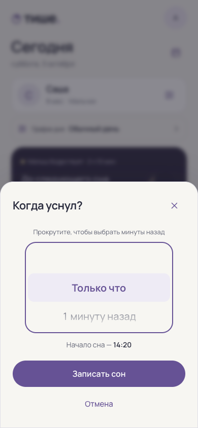

# Перенос актуального design/ в рабочее приложение

Эталон: commit `2c30df1` — Konsta iOS/Material, локальный Manrope, светлая/тёмная тема,
исправления аудита. Приложение и демо используют общие CSS-компоненты.

Реализованы пять разделов, вход/регистрация, профиль малыша с фото и контекстом сна,
графики с описанием и сохранением истории, день/ночь/первый день, формы и административный
просмотр. Укладывание сохраняется на сервере и переживает перезагрузку. Есть попытки без сна,
обстоятельства дня, изменения режима, четыре раздела статистики, CSV и отзываемые публичные
снимки. Данные демонстрации и переключатели сценариев в рабочее приложение не переносятся.

## Проверка 10 октября 2026

- `backend: make check`: 124 теста, типы, архитектура, линтеры.
- PostgreSQL: 66 интеграционных тестов; новая миграция, версии, атомарность, изоляция
  пользователей, неполные циклы, день без дневных снов, приватность/неизменность/отзыв снимка.
- `frontend: npm run check`: 50 runtime-тестов, 21 проверка инструментов/архитектуры,
  линтеры, отсутствие дублирования, production-сборка.
- OpenAPI: 36 операций, 7 примеров, 10 отрицательных проверок.
- Playwright: 13 сценариев с реальным сервером и контролируемыми данными макета.
- Автоматическое сравнение главного экрана с `design/index.html`: iOS/Android × light/dark
  × 320/390/768 px. Шапка, заголовок, малыш, график, герой, метрики, навигация —
  расхождение координат и размеров менее 1 px. Высота окна засыпания также совпадает.
- Все четыре вкладки статистики: 320/390/768 px, обе темы, без горизонтального переполнения.
  Проверены публичный просмотр без входа, CSV, отзыв ссылки и запрет административной записи.
- Проверен контейнер Nginx: локальные CSS/Manrope, SPA-маршрут, 375 px, альбомная ориентация,
  увеличенный текст и reduced motion. Проверка Konsta-компонентов исходного демо также проходит.

Полное пиксельное совпадение экранов с разными пользовательскими данными не утверждается:
в рабочем приложении даты, число графиков, содержимое ленты и ошибки зависят от сервера.
Геометрия сравнивается на одинаковых исходных данных; снимки ниже сделаны автоматической проверкой.

| Макет | Приложение |
| --- | --- |
|  |  |
|  |  |

## Выпуск

Нужна миграция `0005_design_features`; она добавляет поля и таблицы, сохраняя существующие
учётные записи и интервалы. Публичная регистрация по-прежнему управляется серверной настройкой.
Лимит тела Nginx увеличен до 512 КБ для уменьшенного фото малыша. Подробности API — в `api/README.md`.

Для отката приложения после миграции требуется совместимый с новой схемой образ:
старый сервер проверяет точное значение версии схемы. Автоматический downgrade новой миграции
не выполняется, поскольку он удалил бы новые данные.
