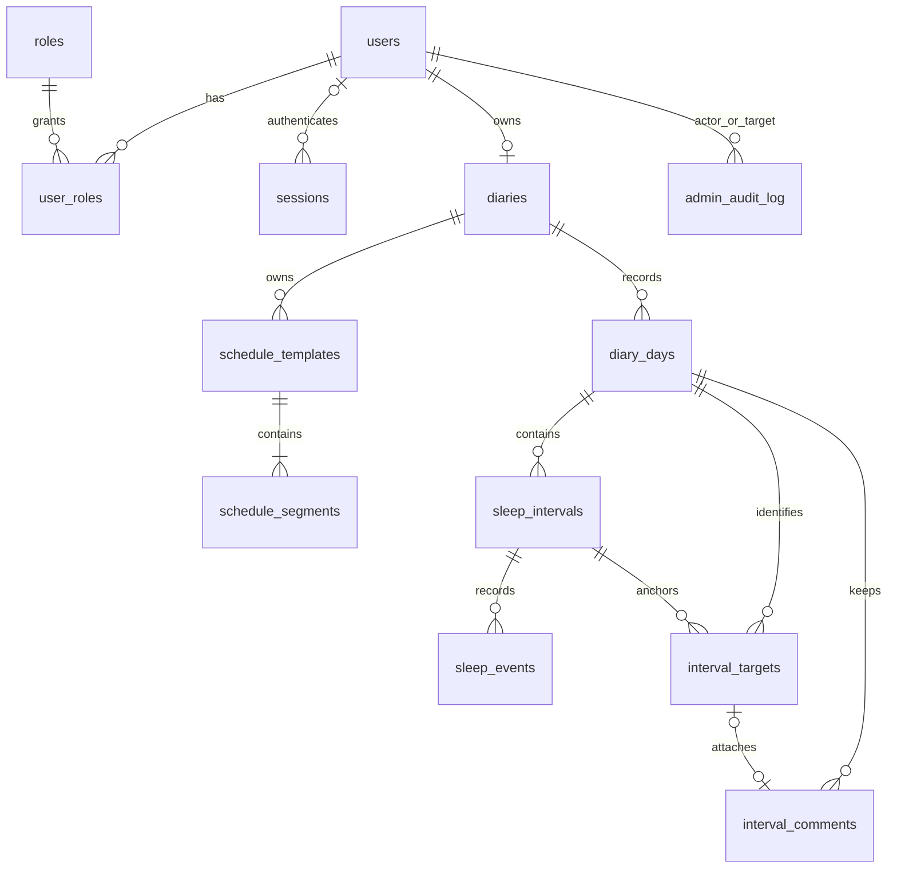

# Схема базы данных прототипа

Результат P-05. Основание — принятый [API-контракт](README.md), [OpenAPI](openapi.yaml) и [примеры прогноза](FORECAST_EXAMPLES.md). Это спецификация хранения. Начальная миграция реализована в `backend/migrations/versions/v0001_initial.py` и соседнем SQL-файле (B-02); основа репозиториев учетной записи/дневника и Unit of Work реализована в B-03. Операции для остальных сущностей расширяются при реализации соответствующих бизнес-сценариев. PostgreSQL, SQLAlchemy, Alembic; доступ приложения через репозитории и инжектируемый Unit of Work согласно `backend/AGENTS.md`.

## 1. Общие соглашения

- Первичные ключи ресурсов — UUID. Исключения: код роли и составные ключи таблиц связей/сегментов. UUID ночного события и комментария поступает от клиента; остальные генерирует backend.
- Время — `timestamptz`; дата цикла — `date`; часовой пояс — IANA-имя в `text`. Сохраняются абсолютные моменты, timezone нужен для локальных дат и отображения.
- Все поля обязательны, если явно не указано `NULL`. `created_at`, `updated_at` — служебные времена ресурсов, не замена `version`.
- `version bigint NOT NULL DEFAULT 1 CHECK (version > 0)` у пользователей, шаблонов, дней, снов и комментариев. Несуществующий день имеет виртуальную API-версию 0, строки с версией 0 в БД нет.
- Фиксированные типы интервалов — `text` с CHECK. Роли — отдельная расширяемая таблица, без PostgreSQL enum.
- Во внешних ключах по умолчанию `RESTRICT`. Удаление пользователя/дневника через API v1 не предусмотрено. Каскадное удаление пользовательских заметок и событий недопустимо.

## 2. Таблицы

### Учетные записи

| Таблица | Поля и ограничения |
| --- | --- |
| `users` | `id`, `email varchar(254) UNIQUE` (нормализованный), `name varchar(80)`, `password_hash text`, `blocked boolean DEFAULT false`, `version`, `created_at`, `updated_at`. Имя непустое; пароль хранится только как Argon2id-хеш. |
| `roles` | `code text PRIMARY KEY`, непустой; начальные значения `user`, `admin`. |
| `user_roles` | `user_id → users`, `role_code → roles`; PK `(user_id, role_code)`. |
| `sessions` | `id`, `user_id → users NULL` для анонимной сессии, `token_hash bytea UNIQUE`, `csrf_nonce bytea`, `expires_at`, `revoked_at NULL`, `created_at`; `expires_at > created_at`. |
| `admin_audit_log` | `id`, `actor_user_id → users`, `target_user_id → users`, `action text` (`block`/`unblock`), `reason varchar(500)`, `created_at`; непустая причина. Только добавление из приложения. |

Email нормализуется одинаково при регистрации и входе (обрезка пробелов, нижний регистр); уникальность обеспечивается БД. Регистрация назначает только `user`. Admin создается вручную, без seed-пароля. Назначение роли не требует изменения схемы.

Cookie содержит случайный непрозрачный токен; в БД сохраняется только его криптографический хеш. CSRF-токен воспроизводится как HMAC от ID сессии и `csrf_nonce` с серверным секретом вне БД; это позволяет повторному `GET /session` вернуть токен без хранения секрета cookie. При входе/регистрации старая сессия отзывается, создается новая. Пароли, хеши и служебные поля сессии не попадают в User DTO.

Блокировка, отзыв сессий и запись аудита выполняются одной транзакцией. Отозванные сессии сохраняются до истечения срока для распознавания заблокированного контекста. Разблокировка не активирует их заново. Индексы сессий: `user_id`, `expires_at`; аудита: `(target_user_id, created_at)`.

### Дневник и графики

| Таблица | Поля и ограничения |
| --- | --- |
| `diaries` | `id`, `user_id → users UNIQUE`, `timezone text`, `default_schedule_id NULL`, `created_at`, `updated_at`. По одному дневнику на пользователя с ролью user. |
| `schedule_templates` | `id`, `diary_id → diaries`, `name varchar(80)` непустое, `archived boolean DEFAULT false`, `version`, `created_at`, `updated_at`; UNIQUE `(diary_id, id)`. |
| `schedule_segments` | `schedule_id → schedule_templates`, `position integer >= 0`, `kind text` (`awake`, `nap`, `night`), `duration_minutes integer` от 1 до 1440; PK `(schedule_id, position)`. |
| `diary_days` | `id`, `diary_id → diaries`, `date`, `timezone text`, `schedule_initialized boolean DEFAULT false`, `schedule_snapshot jsonb NULL`, `version`, `created_at`, `updated_at`; UNIQUE `(diary_id, date)`, UNIQUE `(diary_id, id)`. |

`diaries.(id, default_schedule_id)` ссылается на `schedule_templates.(diary_id, id)`: чужой график нельзя назначить даже прямым SQL. Циклический FK добавляется после создания обеих таблиц. Шаблоны архивируются, не удаляются; список сортируется детерминированно по имени и ID. Индекс шаблонов — `diary_id`.

Вся последовательность сегментов проверяется при записи: непрерывные позиции от 0, `awake, (nap, awake)*, night`, минимум два сегмента. Сумма не обязана равняться 24 часам. Замена сегментов и увеличение версии шаблона — одна транзакция. Позиции и положительные длительности контролирует БД; порядок типов целиком проверяет persistence-операция перед сохранением.

`schedule_snapshot` имеет форму `ScheduleSnapshot`: `{source_id, name, segments}`. Это намеренная копия значений, а не ссылка на актуальные сегменты. `source_id` — происхождение; существование и принадлежность шаблона проверяются при копировании. В БД CHECK допускает только NULL или JSON-объект, точную форму и последовательность проверяет приложение по контракту. Изменение/архивирование шаблона не обновляет снимки. Режим «Начиная с сегодняшнего дня» выполняет отдельное явное назначение обновленного шаблона на сегодня после его сохранения; «Для следующих дней» ограничивается изменением шаблона. Снимки уже назначенных будущих дней сохраняются. Поле даты начала действия шаблона и массовое обновление снимков не нужны.

День материализуется при записи, никогда при GET. Первая собственная запись сна в цикл инициализирует снимок графиком по умолчанию; явный PUT графика дня инициализирует его выбранным шаблоном или NULL. При техническом создании соседнего дня из-за утренней границы `schedule_initialized=false`, снимок NULL: это не преждевременное назначение графика. Последующая первая запись сна применит актуальный default. `true` с NULL означает осознанное отсутствие плана, автоматической подстановки больше нет. CHECK: `schedule_initialized OR schedule_snapshot IS NULL`.

Материализация соседнего дня позволяет хранить версию и идентичность текущего бодрствования без записей при чтении. Она производится при фиксации утренней границы, только для соответствующей локальной даты. Такие дни считаются существующими для истории; день без строк возвращается как пустой с version=0. При удалении фактов строки дней сохраняются, чтобы версия не сбрасывалась.

Часовой пояс дня фиксируется при его создании. Изменение `diaries.timezone` действует на новые дни, старые даты и снимки timezone сохраняются. Изменение timezone/default увеличивает `users.version`, поскольку настройки входят в User API; отдельная публичная версия diary не нужна.

### Сон и ночные отметки

| Таблица | Поля и ограничения |
| --- | --- |
| `sleep_intervals` | `id`, `diary_id → diaries`, `day_id`, `kind text` (`nap`, `night`), `start_at`, `end_at NULL`, `ends_night boolean DEFAULT false`, `version`, `created_at`, `updated_at`, `deleted_at NULL`; UNIQUE `(diary_id, id)`. Составной FK `(diary_id, day_id) → diary_days.(diary_id, id)`. |
| `sleep_events` | `id` (клиентский UUID), `diary_id`, `sleep_id`, `occurred_at NULL` только для отмененного еще не полученного события, `created_at`, `deleted_at NULL`; составной FK `(diary_id, sleep_id) → sleep_intervals.(diary_id, id)`. CHECK: `occurred_at IS NOT NULL OR deleted_at IS NOT NULL`. |

У сна CHECK: `end_at IS NULL OR end_at > start_at`; `NOT ends_night OR (kind = 'night' AND end_at IS NOT NULL)`. Для новых записей `ends_night` вычисляется сервером: закрытый ночной сон начинает новый день. Поле хранится для внутренних связей и совместимости. Миграция `0004_automatic_morning` восстанавливает пропущенную утреннюю границу последнего закрытого ночного сна старого цикла и переносит бодрствование вместе с заметками; исторические промежуточные отрезки не объединяются. Границы цикла и признак полноты вычисляются, не дублируются в таблице дня.

Удаление сна — логическое (`deleted_at`): из ответов и расчетов он исключается, ID сохраняется для связей и отмененных событий. Удаленный сон недоступен для PATCH и восстановления. Удаление разрешается только при отсутствии активных событий; комментарии отвязываются, а не удаляются.

У события нет отдельного типа, счетчика, версии или второго ключа идемпотентности: все события означают «проснулся / заплакал», ключом служит `id`. Автор определяется владельцем дневника. Активные события отсортированы по `(occurred_at, id)`; индекс `(sleep_id, occurred_at, id) WHERE deleted_at IS NULL`. Внутри сна событие допускается от начала до конца включительно; при создании конец еще открыт, время события не позже переданного текущего времени.

### Идентичность интервалов и комментарии

| Таблица | Поля и ограничения |
| --- | --- |
| `interval_targets` | `id`, `diary_id`, `day_id`, `kind text` (`sleep`, `awake`), `sleep_id NULL`, `left_sleep_id NULL`, `right_sleep_id NULL`, `retired_at NULL`, `created_at`. Составные FK дня и всех ссылок сна включают `diary_id`; UNIQUE `(diary_id, id)`. |
| `interval_comments` | `id` (клиентский UUID), `diary_id`, `day_id`, `target_id NULL`, `text varchar(1000)` непустое, `version`, `created_at`, `updated_at`. Составные FK дня и target включают `diary_id`. |

`interval_targets` хранит только идентичность и связи, без времен, длительности или прогноза. Это не ручные записи бодрствования. Поле `timeline.id` — непрозрачное представление этого UUID. Прогноз не получает строку target. Targets создаются/обновляются в транзакциях записи фактов, включая target текущего бодрствования; GET ничего не создает.

CHECK структуры target: для `sleep` задан только `sleep_id`; для `awake` задан `left_sleep_id`, возможен `right_sleep_id`, `sleep_id` пуст. Два соседа не могут совпадать. Левая граница первого дневного бодрствования — последний сон предыдущей ночи, поэтому его day_id может отличаться, но diary_id обязан совпасть. Индексы ссылок нужны для поиска затронутых привязок.

Частичные UNIQUE для активных targets: один `sleep`-target на сон; один `awake`-target на левый сон в дневнике. При начале следующего сна существующий текущий awake-target получает правую границу и сохраняет ID. Обычное исправление времени при прежних соседях сохраняет target. При разрушении промежутка target помечается retired; новый промежуток получает новый ID, даже если позже те же соседи снова окажутся рядом.

Комментарий на исчезнувший интервал получает `target_id=NULL`, сохраняет исходный `day_id`, текст и ID; версия увеличивается. Перепривязка проверяет действующий target того же дневника, меняет day_id на день target и увеличивает версии старого и нового дней. На непустой `target_id` действует UNIQUE: одна заметка на интервал. У NULL-привязок число заметок не ограничено. DELETE заметки удаляет только ее строку; target сохраняется.

## 3. Ограничения пересечений и конкурентные изменения

Для активных снов нужны два ограничения, независимо от предварительных проверок приложения:

- Частичный UNIQUE по `diary_id` при `end_at IS NULL AND deleted_at IS NULL`: единственный открытый сон.
- GiST EXCLUDE по равенству `diary_id` и пересечению `tstzrange(start_at, end_at, '[)')`, только при `deleted_at IS NULL`. Для UUID-равенства используется расширение `btree_gist`. NULL-конец задает неограниченную верхнюю границу; касание концами не считается пересечением.

Дополнительно — частичный UNIQUE по `day_id` при `ends_night AND deleted_at IS NULL`: один завершающий ночь отрезок на цикл. То, что он последний, соответствие локальных дат границам цикла, отсутствие будущих фактов и запрет активных событий у дневного сна (включая смену night → nap) проверяет атомарная persistence-операция по итоговому состоянию. Время проверки передается через инжектируемые часы, не через CHECK с `now()`.

PostgreSQL поддерживает диапазоны и exclusion constraints для запрета пересечений; межстрочные правила нельзя выразить обычным CHECK. Эти механизмы описаны в [документации диапазонов](https://www.postgresql.org/docs/current/rangetypes.html#RANGETYPES-CONSTRAINT) и [ограничений](https://www.postgresql.org/docs/current/ddl-constraints.html).

## 4. Транзакции, блокировки и версии

Одна пользовательская запись — одна транзакция одного persistence-обработчика через Unit of Work. Репозитории используют общую сессию, не делают commit. Бюджет шины остается прежним: API → application → infrastructure для записи; для чтения дня допустимо еще обращение application → domain за расчетом. Проверки целостности записи выполняются внутри атомарной persistence-операции; infrastructure не вызывает другой слой через обратное сообщение.

Для прототипа изменения одного дневника сериализуются блокировкой его строки. Перед записью блокируются участвующие users в порядке UUID, затем diary, затем ресурсы в порядке UUID. Проверки принадлежности, блокировки пользователя и If-Match выполняются после получения блокировок. Такой порядок применяется также к профилю, графикам, входу и блокировке аккаунта; не держать транзакцию во время хеширования пароля или сетевых вызовов. После проверки пароля под блокировкой повторно проверить актуальность пользователя/хеша до создания сессии.

| Операция | Атомарные действия |
| --- | --- |
| Создание/исправление сна | Проверить окончательное состояние и активные события; записать сон; обновить targets/комментарии и затронутые дни, включая следующий день при изменении утренней границы; увеличить версии. |
| Удаление сна | Отклонить при активных событиях; отвязать комментарии исчезающих targets; пометить сон удаленным; обновить соседние интервалы и версии дней. |
| PUT события | После проверки доступа найти UUID, включая удаленные. Идентичный активный повтор возвращает прежнее событие без увеличения версий, даже если сон уже завершен. Иной payload/сон — конфликт, удаленный ID — `event_deleted`. Только новое событие проверяется на текущий ночной сон и время; INSERT увеличивает версии сна и затронутых дней. |
| DELETE события | Сохранить `deleted_at`; повтор ничего не меняет. Если UUID еще не существует, записать tombstone с `occurred_at=NULL` для указанного доступного сна: запоздавший PUT не воскресит отмененную отметку. Версии сна/дней меняются только при удалении активного события. |
| Заметка | Проверить версию и активный target; записать/перепривязать/удалить; обновить версии дней, а для заметки сна также Sleep.version. |
| Назначение графика дня | Проверить Day.version (0 для отсутствующего), владельца и архивность шаблона; скопировать снимок, отметить инициализацию, увеличить версию дня. |
| Архивирование графика | Изменить шаблон и его версию; если он default, очистить ссылку дневника и увеличить User.version; существующие снимки не менять. |
| Блокировка | Проверить роль, запрет самоблокировки/блокировки admin и User.version; изменить статус, увеличить версию, отозвать сессии, добавить аудит. |

Версия каждого затронутого ресурса увеличивается один раз за изменяющую транзакцию, новая строка начинается с 1. Не увеличивать версии от хода часов, повторов PUT/DELETE события или обычного чтения. Дни, показывающие измененный сон как `previous_night`, также затронуты. При изменении границ заметки ее версия увеличивается, даже если текст остался прежним.

Проверка If-Match и запись неделимы; ошибка откатывает также версии, снимки, привязки и аудит. Конфликты UNIQUE/EXCLUDE переводятся в ошибки контракта, без утечки SQL. Отсутствие заголовка — 428, несовпадение — 412. Не увеличивать бюджет шины и не разбивать транзакцию на команды ради отдельных репозиториев.

## 5. Чтение и индексы

`GET /days/{date}` собирается из согласованного снимка данных БД (read-only транзакция REPEATABLE READ), затем DTO передается чистому расчету с одним фиксированным `as_of`. Запросы загружают наборы данных, а не выполняют N+1 для каждого сна/события. Метрики, полнота, текущие длительности, ночные разрывы, `previous_night`, прогноз и issues вычисляются; отдельные таблицы для них не нужны.

Помимо PK/UNIQUE/GiST: индекс активных снов `(diary_id, start_at)`, индекс `(diary_id, day_id)` для снов, `(diary_id, day_id)` для комментариев/targets и индекс каждого внешнего ключа, используемого при поиске зависимостей. Уникальный `(diary_id, date)` обслуживает историю по диапазону и сортировку дат. Список пользователей использует курсор по UUID; поиск по имени/email в прототипе без отдельного поискового сервиса. Специализированные поисковые индексы добавлять по измерениям.

## 6. Связи

Default — необязательная ссылка дневника на собственный шаблон. Снимок дня — JSON-копия без зависимости от дальнейшего изменения шаблона. Диаграмма показывает основные связи; составные FK и условия NULL определены выше.

## 7. Проверки при реализации

- B-02: миграции таблиц, FK, индексов, CHECK и `btree_gist`; только справочные роли, без admin-аккаунта и старых данных.
- B-03/T-01c: репозитории, Unit of Work, общие контрактные тесты fake/PostgreSQL; rollback всей операции и отсутствие самостоятельных commit.
- T-02/T-06: изоляция владельцев, отзыв доступа, гонка входа с блокировкой, запрет административной записи в дневник.
- T-03: снимок переживает изменение/архивирование шаблона, чужой default отклоняется, инициализация дня не перезаписывает явно снятый график.
- T-04/T-04a: одновременные пересекающиеся сны и два открытых сна; стабильность ID текущего бодрствования; осиротевшие заметки; изменение утренней границы; версии соседних дней; гонки отметки с завершением/удалением/исправлением сна; повтор PUT после DELETE, в том числе DELETE до первого PUT.
- T-05: сценарии F01–F05 и отсутствие прогноза в фактических метриках.
- T-08: чистая установка и обновление схемы на PostgreSQL; SQLite не заменяет эти проверки. Резервное копирование и импорт старого localStorage в прототип не входят.

## Дополнения при реализации прототипа

Миграция `0002_auth_limits` добавляет `auth_limits(key, window_start, attempts)` для атомарного лимита входа/регистрации между процессами backend. Лимит — 15 попыток в минуту на операцию и адрес клиента; ошибки входа также учитываются.

Миграция `0003_target_move` делает составной FK target → sleep отложенным до commit. Это позволяет атомарно перенести сон между днями, сохранить осиротевшие заметки и обновить targets без временного нарушения связности. FK по-прежнему обязателен при завершении транзакции.
